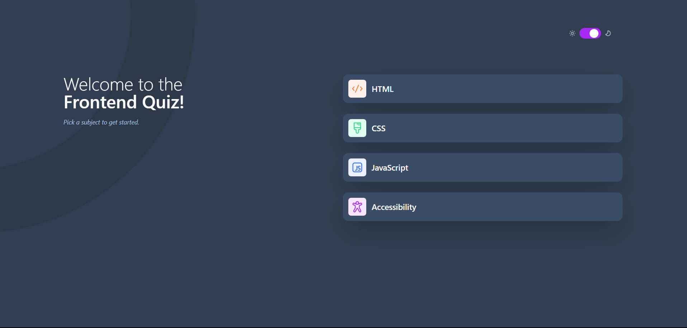

# Frontend Mentor - Frontend quiz app solution

This is a solution to the [Frontend quiz app challenge on Frontend Mentor](https://www.frontendmentor.io/challenges/frontend-quiz-app-BE7xkzXQnU). Frontend Mentor challenges help you improve your coding skills by building realistic projects. 

## Table of contents

- [Overview](#overview)
  - [The challenge](#the-challenge)
  - [Screenshot](#screenshot)
  - [Built with](#built-with)
  - [What I learned](#what-i-learned)
- [Author](#author)

## Overview

Challange made by frontend mentor by Teodor Jenkler, In this challange i have used Redux Toolkit for state and theme switch, Conditional Render, Tailwind CSS and Vite React

### The challenge

Users should be able to:

- Select a quiz subject
- Select a single answer from each question from a choice of four
- See an error message when trying to submit an answer without making a selection
- See if they have made a correct or incorrect choice when they submit an answer
- Move on to the next question after seeing the question result
- See a completed state with the score after the final question
- Play again to choose another subject
- View the optimal layout for the interface depending on their device's screen size
- See hover and focus states for all interactive elements on the page
- **Bonus**: Change the app's theme between light and dark

### Screenshot

### Links

- Solution URL: [github](https://github.com/TedJenkler/QuizApp-Tailwind-Vite-Reduxttk)
- Live Site URL: [gh-pages](https://tedjenkler.github.io/QuizApp-Tailwind-Vite-Reduxttk/)

### Built with

- Semantic HTML5 markup
- Tailwind CSS
- Flexbox
- Mobile-first workflow
- [React](https://reactjs.org/) - JS library
- [Vite](https://vitejs.dev/) - React framework

### What I learned

Practiced my problem solving and redux toolkit

## Author

- Website - [TeodorJenkler](https://www.linkedin.com/in/tedjenklerwebdeveloper/)
- Frontend Mentor - [@TedJenkler](https://www.frontendmentor.io/profile/TedJenkler)
